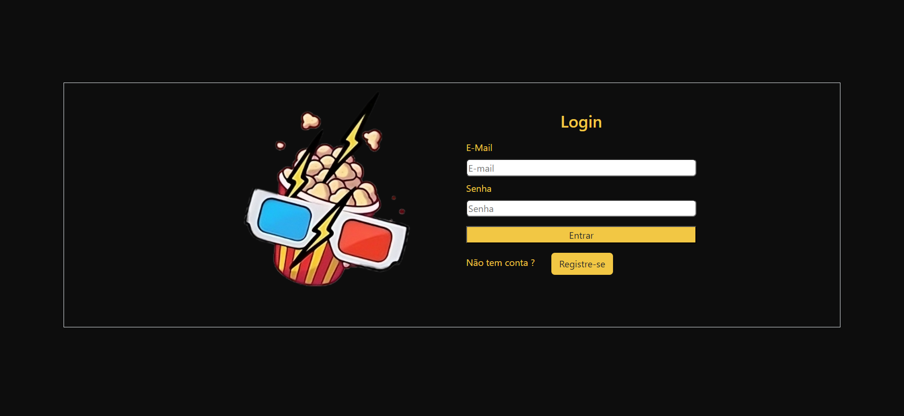
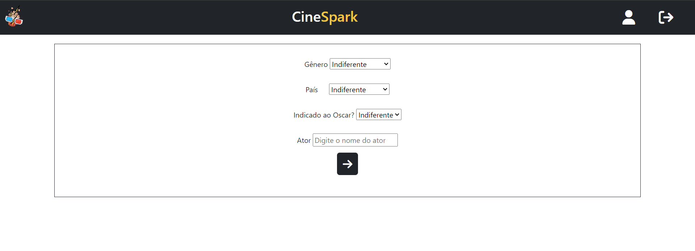
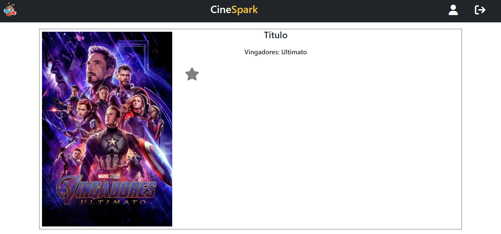
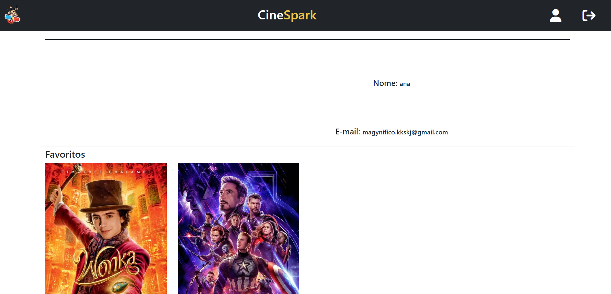

# Programação de Funcionalidades

Implementação do sistema descritas por meio dos requisitos funcionais e/ou não funcionais. Deve relacionar os requisitos atendidos os artefatos criados (código fonte) além das estruturas de dados utilizadas e as instruções para acesso e verificação da implementação que deve estar funcional no ambiente de hospedagem.

Para cada requisito funcional, pode ser entregue um artefato desse tipo.
## Exemplos 

## Requisitos Atendidos

As tabelas que se seguem apresentam os requisitos funcionais e não-funcionais que relacionam o escopo do projeto com os artefatos criados:

### Requisitos Funcionais

|ID    | Descrição do Requisito  | Prioridade | Artefato Criado |
|------|-----------------------------------------|----| ----|
|RF-001| O usuário poderá criar uma  conta inserindo seus dados. | ALTA | login.js |
|RF-002| O usuário poderá selecionar a década e o gênero de preferência, deixando que o aplicativo selecione aleatoriamente o filme, ou poderá preencher um formulário antes, deixando o aplicativo gerar um filme de acordo com as preferências do usuário. | ALTA | Telaquestionario.html |
|RF-003| O aplicativo vai usar as preferências do usuário para recomendar um filme. | MÉDIA | script.js |
|RF-004| Ao exibir o filme recomendado, o aplicativo deverá também exibir foto de capa do filme, além de uma sinopse e classificação. | MÉDIA | telaFilme.html |
|RF-006| Os usuários poderão visualizar detalhes do filme, exemplo: diretor, elenco, etc. | BAIXA | telaFilme.html |
|RF-007| Os usuários poderão deixar uma classificação e comentários sobre o filme assistido, auxiliando outros usuários na hora de escolher. | MÉDIA | telaFilme.html |
|RF-008| Os usuários poderão favoritar os filmes e acessar o histórico dos filmes já vistos ou pesquisados. | BAIXA | telaPerfil.html |

## Descrição das estruturas:

## Notícia
|  **Nome**      | **Tipo**          | **Descrição**                             | **Exemplo**                                    |
|:--------------:|-------------------|-------------------------------------------|------------------------------------------------|
| Id             | Numero (Inteiro)  | Identificador único da notícia            | 1                                              |
| Título         | Texto             | Título da notícia                         | Sistemas de Informação PUC Minas é o melhor                                   |
| Conteúdo       | Texto             | Conteúdo da notícia                       | Sistemas de Informação da PUC Minas é eleito o melhor curso do Brasil                            |
| Id do usuário  | Numero (Inteiro)  | Identificador do usuário autor da notícia | 1                                              |

