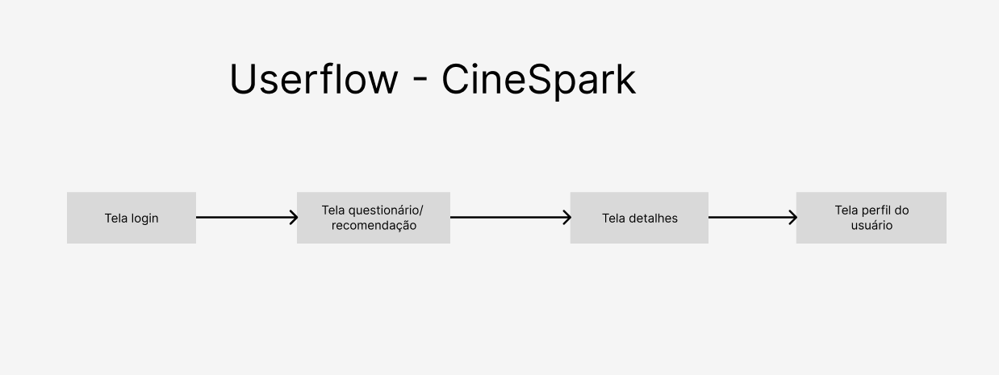
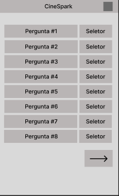
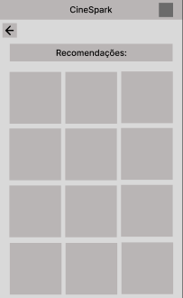
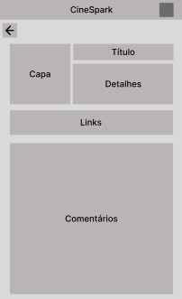
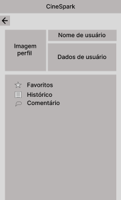
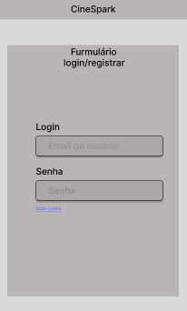

# Projeto de Interface

 As principais interfaces do CineSpark foram desenvolvidas afim de resolver a problemática apontada nas especificações do projeto, onde a demora para escolher um filme de acordo com as preferencias do usuário é o maior problema. Acessando a página oficial da CineSpark os utilizadores podem responder um questionário de forma rápida, e receber uma recomendação totalmente personalizada.

 Através do navegador, os usuários poderão acessar a página da CineSpark, na qual podem efetuar um novo registo ou autenticar-se numa conta já existente. Após a autenticação, os usuários poderão completar um questionário que lhes permitirá personalizar a sua experiência no CineSpark de acordo com as suas preferências. Além disso, os utilizadores poderão favoritar os seus filmes favoritos, entrar no seu perfil, no qual poderão visualizar os seus dados pessoais e terão também a capacidade de visualizar a lista de filmes favoritos. 

## User Flow

## Wireframes

